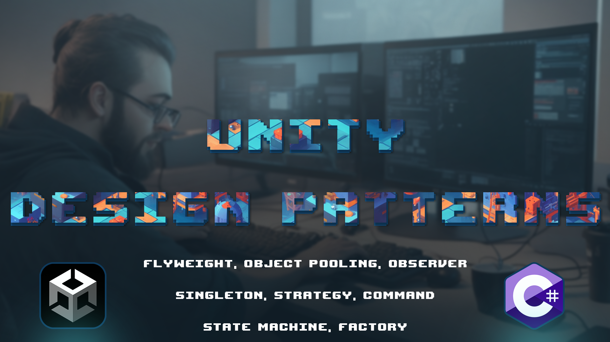

# Unity Design Patterns

This repository demonstrates the implementation of various design patterns in Unity using C#. Each design pattern is showcased through a separate example within this project.

By understanding and implementing these design patterns, you can improve the structure, maintainability, and extensibility of your Unity projects. Each pattern addresses specific challenges and provides solutions that can enhance the quality of your game development endeavors.

# Design Patterns Implemented

### 1. Flyweight

The Flyweight pattern focuses on minimizing memory usage by sharing common data among multiple similar objects. This is particularly useful when dealing with a large number of instances that have overlapping properties. In game development, this can be seen in scenarios where numerous objects share common characteristics but differ in certain attributes.

For example, consider a game where you have thousands of bullets on the screen. Instead of creating a separate instance for each bullet, the Flyweight pattern allows you to create a single object that represents the bullet's behavior and appearance. Each bullet's unique attributes (position, rotation, etc.) can then be stored externally and associated with the shared bullet object.

### 2. Object Pooling

Object Pooling is a technique used to optimize performance by reusing objects instead of repeatedly creating and destroying them. This is particularly beneficial when dealing with frequently spawned and despawned objects, like enemies, bullet or particles.

In a game, rather than instantiating a new enemy every time it appears and destroying it when defeated, you can create a pool of enemy instances at the start of the level. When an enemy is needed, you take an available instance from the pool and reset its properties. When the enemy is defeated or goes off-screen, you return it to the pool for future use. This minimizes the overhead of object creation and destruction.

### 3. Observer

The Observer pattern is used to establish a relationship between objects where one object (the subject) maintains a list of its dependents (observers) and notifies them of any changes in its state. This is commonly used for event handling.

### 4. Singleton

A Singleton ensures that a class has only one instance and provides a global point of access to that instance. This is useful for scenarios where you want a single point of control for certain functionalities.

In a game, a GameManager class can be implemented as a Singleton. It manages the game state, score, and other global aspects. By enforcing only one instance, you prevent conflicting updates and ensure consistency throughout the game.

### 5. Strategy

The Strategy pattern allows you to define a family of algorithms, encapsulate each algorithm, and make them interchangeable. This is beneficial when you want to provide various options for performing a certain task.

Consider a character customization system in a game. Different outfits can affect the character's movement speed, attack strength, or appearance. Instead of hardcoding these behaviors, you can implement each outfit as a strategy, allowing players to dynamically switch between them.

### 6. Command

The Command pattern encapsulates a request as an object, thereby allowing you to parameterize clients with different requests and queue or log these requests. This is helpful when you want to decouple sender and receiver of a request.

In a game, you can implement player actions (jump, attack, etc.) as commands. This enables features like undo/redo functionality and remote command execution. For example, a player can perform an attack command, and the game system can execute the corresponding attack behavior.

### 7. State Machine

The State Machine pattern models an object's behavior by allowing it to change its behavior when its internal state changes. This is valuable for managing complex state transitions and behaviors.

Think of a traffic light simulation in a game. The traffic light has different states (Red, Yellow, Green), and it transitions between these states based on predefined rules (timing). Implementing this as a state machine simplifies managing the traffic light's behavior and transitions.

### 8. Factory

The Factory pattern provides an interface for creating objects in a superclass, but allows subclasses to alter the type of objects that will be created. This is useful when you want to delegate the responsibility of object creation to specialized classes.

In a game, you might have different types of enemies. Using a factory, you can create an EnemyFactory class with methods for creating specific enemy types. This encapsulates the creation logic and ensures a consistent way of creating enemies throughout the game.

## Getting Started

To explore each design pattern example, follow these steps:

1. Clone this repository to your local machine.
2. Open the Unity project using Unity Hub.
3. Navigate to the specific scene associated with each design pattern.
4. Play the scene and interact with the implemented design pattern.

## Acknowledgments

The implementation of these design patterns is inspired by various online resources, design pattern books, and tutorials. Credits to the authors of those materials for their insightful guidance.

